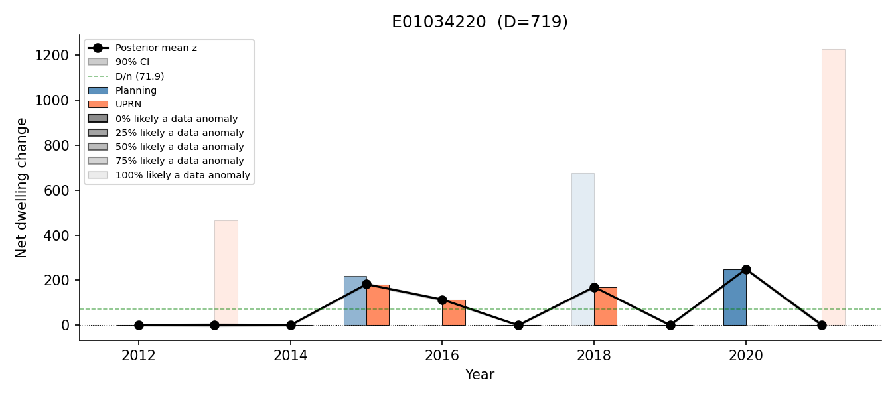
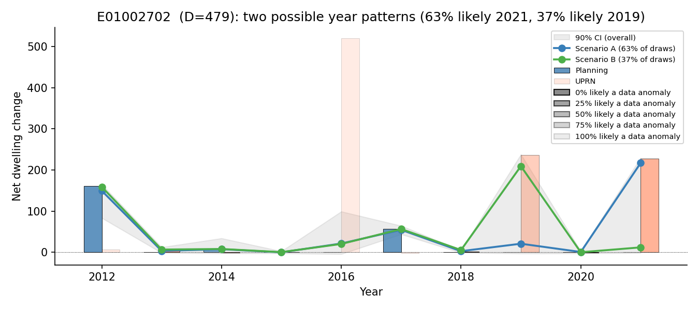
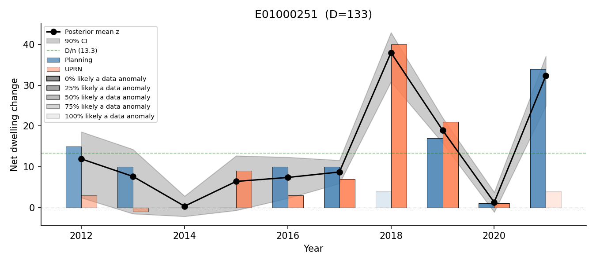
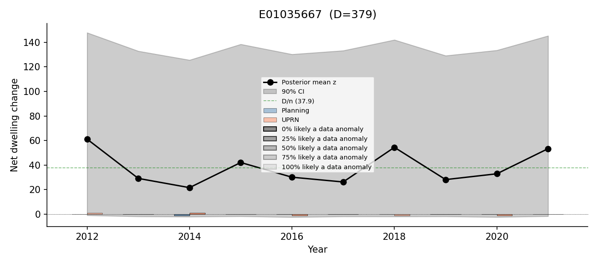

# London dwelling-stock change, 2012-2021: summary of findings

This summarises what our model of annual dwelling-stock change across London's LSOAs
currently shows. For a browsable, area-by-area version of everything below, see the
live dashboard:
[dwelling-change-dashboard](https://conor-dempsey-london.github.io/dwelling-change-dashboard/).

## Total change across London, 2011–2021

Between the 2011 and 2021 Censuses, London's dwelling stock grew by an estimated
**~354,000 homes**. This is the Census-recorded figure itself, not a separate model
estimate of it.

For this round of modelling, we have chosen to treat that Census figure — for
London overall and for every borough and small area within it — as exactly correct.
This is a deliberate simplifying assumption, not a claim that the Census itself is
free of error. We are choosing not
to model census error in this round, because doing so would add complexity
for a question (year-by-year timing) where it is unlikely to change the picture massively.
It is a choice we can revisit in future work — treating the census total as uncertain would let
that uncertainty flow through to every estimate below.

Given that starting assumption, the model adds no further uncertainty of its own to
the decade total for London or for any borough: it is built so that every area's
yearly figures always add up, by construction, to that area's Census-recorded
10-year total.

The modelling question we are trying to answer is
**how that change was distributed year by year**. That is where the model's own
uncertainty lives, on top of whatever uncertainty already exists in the Census
figure itself, and it varies a lot from area to area.

For example, London's estimated change by year (with a 90% plausible range):

| Year | Estimated change | Plausible range |
|---|---|---|
| 2012 | 32,100 | 30,700 – 33,600 |
| 2013 | 34,100 | 32,900 – 35,400 |
| 2014 | 34,900 | 33,700 – 36,200 |
| 2015 | 38,000 | 36,700 – 39,200 |
| 2016 | 44,400 | 42,900 – 45,900 |
| 2017 | 39,600 | 38,400 – 40,800 |
| 2018 | 36,400 | 35,100 – 37,700 |
| 2019 | 34,700 | 33,300 – 36,100 |
| 2020 | 32,200 | 31,000 – 33,400 |
| 2021 | 27,500 | 26,100 – 28,800 |

## Confidence by area

We looked at all 4,987 London LSOAs individually. Each one falls into one of four
groups:

- **Confident (47% of areas)** — we have a single, reliable year-by-year picture of
  when the change happened.
- **A small number of likely stories (21% of areas)** — we can't pin down exactly
  which year(s) the change happened in, but the uncertainty narrows down to 2 or 3
  specific, describable possibilities, each with a stated likelihood (e.g. "60%
  likely 2019, 40% likely 2021") — and this genuinely affects a substantial share of
  that area's total change, not just a small part of it.
- **Mostly confident, with a minor loose end (10% of areas)** — the area's dominant
  year(s) of change are just as reliable as a "confident" area's, but one or two
  minor years — together accounting for less than a quarter of that area's total
  change — can't be pinned down. This is sometimes an unresolved loose end, and
  sometimes a "small number of likely stories" split (as above) that itself only
  concerns that same minor slice of the total. 
- **Genuinely unclear (23% of areas)** — the total change for the area is just as
  reliable as anywhere else, but we cannot say with any confidence which year(s) it
  happened in, and unlike the category above, this isn't confined to a minor part of
  the decade's change. This is usually because the underlying planning/OS AddressBase
  records for that area are too sparse or too inconsistent over the decade to
  distinguish between years. We report the total only in these cases, rather than
  guessing.

We report this last group directly rather than omitting it. It is a real, sizeable
minority, and it reflects a genuine limit of the underlying records, not a
shortcoming we expect to fix by refining the model further.

### Example areas

- **A confident area** — an LSOA in Newham grew by about 720 homes over the decade,
  and we're confident it happened in four clear bursts (around 2015, 2016, 2018 and
  2020), with next to nothing in the other six years.

  

- **A "small number of stories" area** — an LSOA in Islington grew by about 480
  homes. We can't say for certain which year it happened in, but the possibilities
  narrow to two: roughly 63% likely it was 2021, 37% likely it was 2019.

  

- **A "mostly confident" area** — an LSOA in Barnet grew by about 130 homes. We're
  confident the bulk of that (~38 and ~32 homes) landed in 2018 and 2021
  respectively; the only open question is a much smaller, roughly 15%-of-total
  amount split somewhere across 2012 and 2013.

  

- **A genuinely unclear area** — an LSOA in Tower Hamlets grew by about 380 homes,
  but the records don't let us say in which year(s) — only that it happened
  sometime across the decade.

  

*In each chart, the black line/grey band (or coloured scenario lines) show the model's
estimate; the blue and orange bars show the two underlying data sources (planning
completions and OS AddressBase-derived records) the model is reconciling. A faded bar means
the model judges that observation is more likely a data anomaly than a real change — the
more faded, the more likely — which is why the estimate sometimes doesn't move to match a
faded spike (for example, Newham's large 2013 and 2021 bursts above are both strongly faded,
and Islington's 2016 burst is faded too, while its 2019 burst stays solid).*

## Variation by borough

Growth is concentrated in a fairly small number of boroughs: **Tower Hamlets**
(~29,000 homes), **Newham** (~22,000), **Southwark** (~19,000), **Greenwich**
(~16,000) and **Barnet** (~16,000) account for a disproportionate share of London's
total growth. At the other end, **City of London**, **Richmond upon Thames** and
**Kingston upon Thames** each saw only a few thousand.

Confidence in the year-by-year picture also varies by borough — generally, the
areas where we're least sure *when* the change happened are the same ones with the
most activity to reconcile (more growth means more records to cross-check, and more
opportunity for them to disagree). Richmond upon Thames, Enfield and Kingston upon
Thames have the most areas with a confident year-by-year picture; City of London,
Tower Hamlets and Bexley have the fewest — for City of London and Tower Hamlets,
that's a direct consequence of having some of the highest volumes of change to
account for.

## Open questions and next steps

- **Both of our two main data sources — planning completions data and the OS
  AddressBase-derived dwelling-change records — likely have their own data-quality
  issues that we have not yet fully characterised.** We have not yet dug deeply
  into what could be extracted directly from the underlying planning-completions
  database, which is likely the biggest single source of improvement to model
  quality available. Similarly for the OS AddressBase-derived records: further
  information could potentially be extracted — for example, additions and removals
  as separate series rather than just their net — which could enrich the input and
  improve the model. Both are planned as further work.

- **Treating the Census counts as exact** — if we think the census numbers contain
  substantial error, we could enforce this constraint probabilistically instead of
  exactly. But this would add complexity for probably little gain, and isn't
  something we recommend doing without a specific reason.

- **This kind of model can also be extended to draw on other data sources** —
  Energy Performance Certificate (EPC) records are one candidate that could plausibly
  help distinguish which years changes happened in.

- **We have tested, but not included, two other modelling ideas**: accounting for a
  delay between when a change happens and when it shows up in the records ("temporal
  lag"), and letting changes in one area inform the picture in neighbouring areas
  ("spatial spillover"). Neither showed a clear improvement over the simpler model
  reported here once tested properly — the spatial-spillover version scored clearly
  worse on our most rigorous accuracy check, and the lag version, combined with this
  model, gave at best a marginal improvement on one measure while making the
  year-by-year confidence picture worse. We haven't ruled out a different way of
  building in either idea helping in future however.

- **The dashboard is useful for area-specific questions** — anyone can look
  up a specific LSOA or borough and see exactly which group it falls into and why,
  rather than relying on the borough-level averages above. It also breaks down which
  kinds of areas tend to fall into the "genuinely unclear" group — in short, areas
  with a larger amount of change to account for are systematically less likely to
  have a confident year-by-year picture, regardless of borough. Looking into the outputs using the dashboard is likely to surface issues and possible sources of improvement. One benefit of this kind of model is that it is quite easy to interrogate why the
model makes the posterior predictions that it does, so if you have questions about
why the model makes a particular prediction, let us know and we can look into it.
